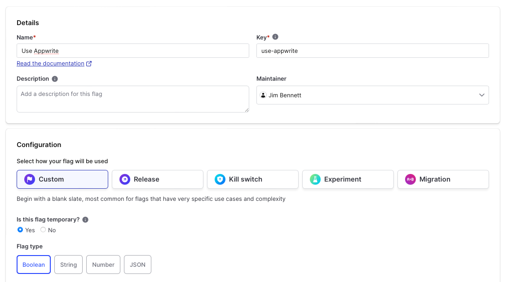
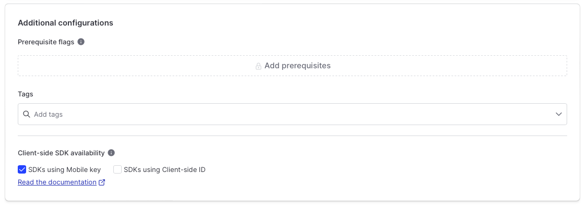
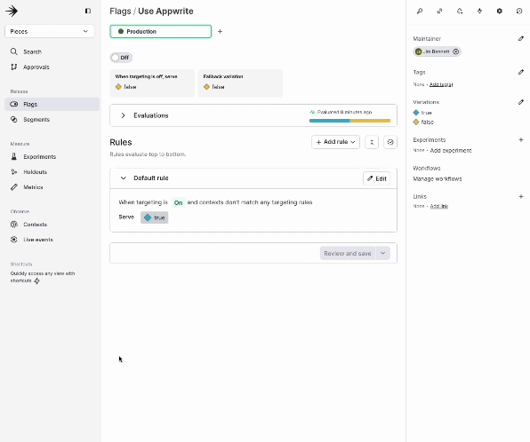

# SideQuests: Your Open-Source Todo Companion

This repo contains an example ToDo app using Flutter, with ToDo items considered as side quests. What makes this app different to other reference ToDo app implementations is that it is configurable via feature flag to be either all local, or running in the cloud. This repo is designed to show 3 concepts:

- How you can leverage [Pieces for Developers](https://pieces.app) to help you develop an app
- How to use [Launch Darkly](https://launchdarkly.com) to control the features of your app, allowing you to test out a feature for some users before a full roll-out.
- How to use [Appwrite](https://appwrite.io) to provide a back end for a Flutter app.

> Remember to install [Pieces](https://pieces.app) and the [browser extension for your current browser](https://pieces.app/plugins/web-extension) when reading this code, as that way you can quickly save code snippets to Pieces using the **Copy and save button** that appears when you hover over any code.

Launch Darkly is used to quickly flip between offline only, and Appwrite for the storage of the side quests, allowing you to run this app fully offline for a trial rollout, then flip to the cloud to support synching of side quests.

## How Pieces helped

When developing this, I was reasonably new to Flutter, and new to Launch Darkly and Appwrite. So how did I build this quickly? By leveraging Pieces for Developers.

Pieces is an on-device AI coding assistant that boosts developer productivity by helping you solve complex development tasks through a contextual understanding of your entire workflow. So what does this mean in terms of writing this app?

### Code snippets

I used the code snippet functionality to store code snippets to create flutter components, interact with Launch Darkly, and make calls to Appwrite. I found these code snippets in the relevant documentation and saved them using the [Pieces browser extension](https://pieces.app/plugins/web-extension).

For example, I would read through the docs, saving snippets as I went, such as this [Initialize the client sample code](https://docs.launchdarkly.com/sdk/client-side/flutter#initialize-the-client). From Pieces I can then add tags, such as tagging this as `sidequests` so I can quickly search my snippets for everything I've saved for this project. Finally I can take advantage of the edit feature with options to automatically optimize for readability to help structure the code a bit nicer and add comments. For example, it converts this origina code snippet:

```dart
final config = LDConfig(
  CredentialSource.fromEnvironment,
  AutoEnvAttributes.enabled,
  // all other configuration options are optional
);

final context = LDContextBuilder()
  .kind("user", "user-key-123abc")
  .build();

final client = LDClient(config, context);
await client.start();
```

to this:

```dart
// Create configuration object
final config = LDConfig(
  // Use credentials from environment variables
  CredentialSource.fromEnvironment,
  // Enable automatic environment attributes
  AutoEnvAttributes.enabled,
  // All other configuration options are optional
);

// Build context with kind "user" and key "user-key-123abc"
final context = LDContextBuilder()
  .kind("user", "user-key-123abc")
  .build();

// Initialize LaunchDarkly client with the configuration and context
final client = LDClient(config, context);

// Start the client
await client.start();
```

You can find the resulting snippet [shared here](https://jimbobbennett.pieces.cloud/?p=d7b24ea907) leveraging the Pieces share snippet functionality.

### Copilot chats

Pieces has copilot chats, powered by the LLM of your choice, ranging from cloud to on-device models. These copilot chats have access to a range of context, not just what you are working on in your browser. This means as you are working you can ask the LLM anything about your code base, other code, and more.

For example, as I was architecting my app, I needed a way to notify changes. For example, when I access the Appwrite database, this is asynchronous, so I need to be able to notify and rebuild the UI once the data is loaded. The copilot helped me here. And because Pieces is everywhere, I didn't even need to leave my IDE - I used the [Pieces VS Code extension](https://docs.pieces.app/extensions-plugins/vscode)! Pieces keeps all your extensions in sync, so Copilot chats or saved snippets are available wherever you use Pieces.

My first question to the copilot:

```output title="Copilot chat"
In flutter, how can I notify the UI when an asynchronous task is complete? Just give me suggestions, not code
```

Some prompt engineering here! By asking just for the suggestions, the asnwer is smaller. Otherwise most LLMs will also spit out code. This was the response:

```output title="Copilot chat"
Certainly! In Flutter, there are several ways to notify the UI when an asynchronous task is complete. Here are some suggestions:

1. setState(): If you're working within a StatefulWidget, you can use setState() to trigger a rebuild of the widget tree after the async task completes.

2. Future and FutureBuilder: Use a Future to represent the async operation and wrap your UI in a FutureBuilder. This widget automatically rebuilds when the Future completes.

3. Stream and StreamBuilder: Similar to FutureBuilder, but for continuous data updates. Use a Stream to emit values and a StreamBuilder to listen and rebuild the UI.

4. Provider package: Utilize a ChangeNotifier or other provider classes to manage state and notify listeners when the async task finishes.

5. BLoC (Business Logic Component) pattern: Implement a BLoC to separate business logic from the UI. Use streams to communicate between the BLoC and the UI.

6. GetX state management: If you're using the GetX package, you can use its reactive state management features to update the UI.

7. MobX: Another state management solution that allows you to create observable state and automatically update the UI when it changes.

8. ValueNotifier and ValueListenableBuilder: Use a ValueNotifier to hold the state and wrap your UI in a ValueListenableBuilder to rebuild when the value changes.

9. Callbacks: Pass a callback function to your async method and call it when the task completes, triggering a UI update.

These methods provide different levels of complexity and separation of concerns. Choose the one that best fits your specific use case and project structure.
```

I could then pick a suggestion and dig more into it. I went for the `ChangeNotifier` as I will have lots of state changing things such as detecting Launch Darkly flag changes, and things like `setState` and `FutureBuilder` look like they are designed for running background tasks at a known time.

```output title="Copilot chat"
How can I use ChangeNotifier?
```

And the copilot gave me an extensive answer with code samples, which I can then save to my snippets, such as [this basic `ChangeNotifier` implementation example](https://jimbobbennett.pieces.cloud/?p=28f4429c53).

### Live context

Pieces can act as your assitant, watching over your shoulder to remember everything you are doing in a secure and private way, so you can ask questions later. This is so useful as I'm reading through documentation. For example, I was reading through the Appwrite docs and as usually ended way down the rabbit hole away from what I was hoping to do. I was looking for code on how to create a document in a database collection, found that, then dug deeper in other docs. By the time I realized, I'd lost my page. Pieces to the rescue!

I started a copilot chat, turned on live context and asked:

```output title="Copilot chat"
what was the flutter code snippet I was just looking at in my browser for creating a document in appwrite
```

And this was the response:

```output title="Copilot chat"
The Flutter code snippet you were looking at in your browser for creating a document in Appwrite is as follows:

import 'package:appwrite/appwrite.dart';

main() async {
  final client = Client()
    .setEndpoint('https://cloud.appwrite.io/v1')
    .setProject('<PROJECT_ID>');

  final databases = Databases(client);

  try {
    final document = await databases.createDocument(
      databaseId: '<DATABASE_ID>',
      collectionId: '<COLLECTION_ID>',
      documentId: ID.unique(),
      data: {},
    );
    print(document);
  } on AppwriteException catch (e) {
    print(e);
  }
}

This snippet demonstrates how to set up the Appwrite client, configure the endpoint and project ID, and create a document in a specified database and collection. Make sure to replace `<PROJECT_ID>`, `<DATABASE_ID>`, and `<COLLECTION_ID>` with your actual project, database, and collection IDs.
```

The actual response had the code as a code snippet that I could save, which I did, and then added to my code.

### Code lens

Another feature I use a lot is the code lens in VS Code. It gives quick options to comment and explain code. I must admit I was lazy when I wrote this code, so didn't bother to comment it. Quick use of the code lens, and my code is getting commented for me!

## Configure the cloud services

You will need to manually configure the relevant cloud services, then store the appropriate API keys in the [`.env`](./mobile-app/.env) file. This repo doesn't ship with a `.env` file, and this file is ignored in the `.gitignore` to avoid accidentally committing your keys to source code control. There is an `.env.example` file that shows you the keys you need to set.

1. Copy `.env.example` to `.env`
1. Set up the services listed below and set the relevant keys in the `.env` file.

### Launch Darkly

1. Create a LaunchDarkly account at [https://launchdarkly.com](https://launchdarkly.com) if you don't have one.
1. Create a new LaunchDarkly project and obtain your mobile key.
1. Configure your LaunchDarkly mobile key in the `.env` file.

   ```ini
   LAUNCHDARKLY_MOBILE_KEY=mob-xxx
   ```

1. Add a [new custom boolean flag](https://docs.launchdarkly.com/home/flags/custom) with the key `use-appwrite`, and tick the **SDKs using Mobile Key** checkbox

   
   


### Appwrite

1. Create an Appwrite account at [https://appwrite.io](https://appwrite.io).
1. Create a new Appwrite project.
1. Create an Appwrite database called `sidequests`
1. Create an Appwrite collection in your database called `sidequests`, with a string column called `name`, and a bool column called `completed`.
1. Configure your Appwrite project ID, database ID, and collection ID in the `.env` file.

   ```ini
   APPWRITE_PROJECT_ID=xxx
   APPWRITE_DATABASE_ID=sidequests
   APPWRITE_COLLECTION_ID=xxx
   ```

## Build and run the app

This is a Flutter app, so you will need to have Flutter installed by following the [Flutter install documentation](https://docs.flutter.dev/get-started/install).

1. Navigate to the project directory:

   ```bash
   cd sidequests/mobile_app
   ```

1. Install dependencies:

   ```bash
   flutter pub get
   ```

1.Run the application:

   ```bash
   flutter run
   ```

## Use the feature flag

To control the feature flag, you can turn it on and off from the Launch Darkly project. By default with a boolean flag, when it is turned off, evaluations will return `false`, and when turned on, evaluations will return `true`. There are more controls for this, including targeting certain users, and you can read about this in the [Launch Darkly flags documentation](https://docs.launchdarkly.com/home/flags/toggle).

When you first create the flag, it will be off and evaluate to `false`. This means when you run SideQuests, you will not need to log in, and all your sidequests will be stored locally in a SQLite database.

To flip to using Appwrite, turn this flag on, select **Review and Save**, enter the environment name to confirm - this should be `production`, then select **Save**.



The app will then reload and you will then need to create an account and log in. Once done, you can save side quests to Appwrite.

## License

This project is licensed under the MIT License - see the [LICENSE](LICENSE) file for details. 
